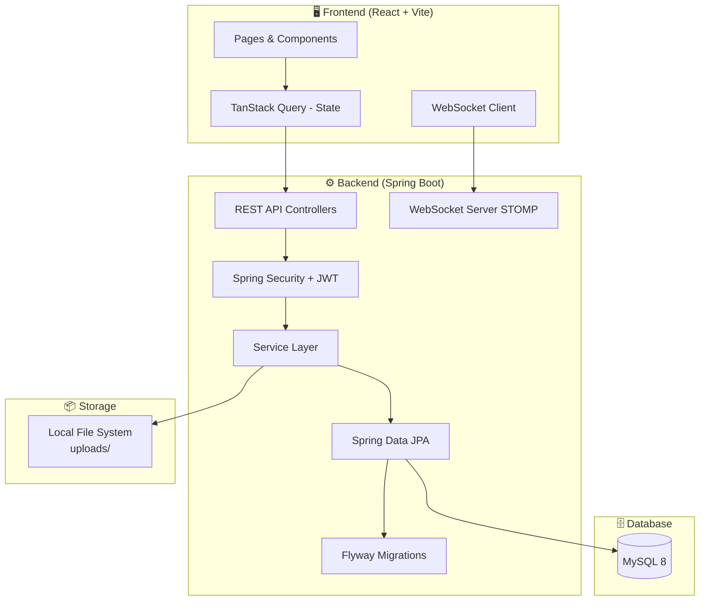

# 📘 VCollab Platform — Comprehensive Documentation

> **VCollab** is a student-focused collaboration and content sharing platform built by **VTECH AI Solutions**. It connects school students and university students, enabling them to showcase projects, share knowledge, collaborate, and build their academic digital presence.

---

## 📌 Table of Contents

1. [Platform Overview](#1-platform-overview)
2. [Tech Stack](#2-tech-stack)
3. [User Roles & Education Types](#3-user-roles--education-types)
4. [Core Modules & Features](#4-core-modules--features)
   - 4.1 [Authentication & Account Management](#41-authentication--account-management)
   - 4.2 [User Profile](#42-user-profile)
   - 4.3 [Projects](#43-projects)
   - 4.4 [Posts](#44-posts)
   - 4.5 [Blogs](#45-blogs)
   - 4.6 [Home Feed](#46-home-feed)
   - 4.7 [Social Graph (Follow System)](#47-social-graph-follow-system)
   - 4.8 [Messaging & Conversations](#48-messaging--conversations)
   - 4.9 [Notifications](#49-notifications)
   - 4.10 [Comments & Replies](#410-comments--replies)
   - 4.11 [Reactions (Likes)](#411-reactions-likes)
   - 4.12 [Save / Bookmarks](#412-save--bookmarks)
   - 4.13 [Search & Discovery](#413-search--discovery)
   - 4.14 [Project Collaboration Requests](#414-project-collaboration-requests)
   - 4.15 [Content Reporting](#415-content-reporting)
   - 4.16 [Warnings System](#416-warnings-system)
   - 4.17 [Categories](#417-categories)
   - 4.18 [Content Targeting](#418-content-targeting)
   - 4.19 [Media Management](#419-media-management)
   - 4.20 [Tags](#420-tags)
5. [Admin Panel](#5-admin-panel)
   - 5.1 [Dashboard Summary](#51-dashboard-summary)
   - 5.2 [User Management](#52-user-management)
   - 5.3 [Content Moderation](#53-content-moderation)
   - 5.4 [Reports Management](#54-reports-management)
   - 5.5 [Warnings Management](#55-warnings-management)
   - 5.6 [Categories Management](#56-categories-management)
   - 5.7 [CMS Blocks](#57-cms-blocks)
   - 5.8 [Recycle Bin](#58-recycle-bin)
   - 5.9 [Audit Logs](#59-audit-logs)
   - 5.10 [Exports](#510-exports)
6. [Real-Time Features](#6-real-time-features)
7. [Content Visibility & Privacy](#7-content-visibility--privacy)
8. [Use Cases](#8-use-cases)
9. [User Activities Summary](#9-user-activities-summary)
10. [Notification Types](#10-notification-types)
11. [API Overview](#11-api-overview)
12. [System Architecture](#12-system-architecture)

---

## 1. Platform Overview

**VCollab** is an academic social networking and collaboration platform designed for students — both **school students** (Grades 1–12, O/L, A/L) and **university students** (Year 1–4, Faculty/Semester tracking). It allows students to:

- Showcase their academic and personal **projects**
- Publish **posts** (updates / status)
- Write long-form knowledge **blogs**
- Follow peers and build a **social network**
- **Collaborate** on projects via collaboration requests
- **Chat** with peers via real-time messaging
- Receive **real-time notifications** for all activities
- **Save** content to revisit later
- **Report** inappropriate content for admin review
- Discover trending **content** and **contributors**

VCollab separates content for school and university viewers, enabling a targeted, age-appropriate learning environment.

---

## 2. Tech Stack

| Layer | Technology |
|-------|-----------|
| **Frontend** | React (Vite), React Router, TanStack Query, Lucide Icons, Vanilla CSS |
| **Backend** | Java Spring Boot 3.x |
| **Database** | MySQL 8 (via Spring Data JPA + Flyway Migrations) |
| **Auth** | JWT (JSON Web Tokens), BCrypt password hashing |
| **Real-Time** | WebSocket (Spring WebSocket / STOMP) |
| **File Storage** | Local file system (configurable upload directory) |
| **API Style** | RESTful JSON API |
| **State Management** | TanStack Query (React Query) |
| **Build System** | Maven (Backend), Vite (Frontend) |
| **Containerization** | Docker / Docker Compose |
| **Health Monitoring** | Spring Actuator (Health, Liveness, Readiness probes) |

---

## 3. User Roles & Education Types

### Roles

| Role | Description |
|------|-------------|
| `USER` | Standard student account — can create content, interact, and collaborate |
| `ADMIN` | Platform moderator — has access to the full Admin Panel |

### Education Types

| Type | Target Audience |
|------|----------------|
| `SCHOOL` | Students in Grades 1–10, O/L, A/L |
| `UNIVERSITY` | Undergraduate students, Year 1–4 |

Users select their education type during profile setup. University students can additionally toggle **"Show School Content"** in the feed, giving them access to content from school-level students. School-level content is filtered by default to keep the experience age-appropriate.

### User Profile Fields

| Field | Description |
|-------|-------------|
| Full Name | Display name |
| Username | Unique @handle |
| Bio | Short personal description |
| Profile Image | Avatar photo (uploadable) |
| Cover Image | Banner photo (uploadable) |
| Institution | School or University name |
| Department / Faculty | Academic department |
| Year of Study / Grade | Academic level |
| Academic Year & Semester | University-specific |
| Skills | Comma-separated skills list |
| GitHub URL | External GitHub profile link |
| LinkedIn URL | LinkedIn profile link |
| Website URL | Personal website link |
| Date of Birth | Optional personal info |
| Education Type | `SCHOOL` or `UNIVERSITY` |
| Private Account | Toggle public/private profile |
| Open Messaging | Allow messages from non-followers |
| Follower Count | Auto-tracked |
| Following Count | Auto-tracked |
| Project Count | Auto-tracked |
| Post Count | Auto-tracked |
| Blog Count | Auto-tracked |

---

## 4. Core Modules & Features

### 4.1 Authentication & Account Management

VCollab uses **JWT-based authentication** with secure token expiry (24 hours by default).

#### Features:
- **Register** — Create account with full name, username, email, password
- **Login** — Email + password authentication, JWT issued on success
- **Forgot Password** — Request a password reset link via email
- **Reset Password** — Confirm new password via secure token link
- **Logout** — Client-side token invalidation

---

### 4.2 User Profile

Every user has a rich public profile page that aggregates all their content and social activity.

#### Features:
- View **my profile** (authenticated)
- View **any public profile** by username
- **Edit profile** — update name, bio, skills, social links, education details
- Upload / change **profile image**
- Upload / change **cover image**
- See follower / following counts
- See list of user's **projects**, **posts**, and **blogs**
- **Private profile** toggle — hides content from non-followers
- **Open messaging** toggle — allows DMs from non-followers

---

### 4.3 Projects

Projects are the flagship content type on VCollab. They represent detailed academic or personal projects that students have built.

#### Features:
- **Create project** with:
  - Title, Short Description, Full Description (rich text)
  - Thumbnail image
  - Multiple media attachments (images, videos)
  - Tags (comma-separated or auto-suggested)
  - Tech Stack
  - Category
  - GitHub URL
  - Demo/Live URL
  - YouTube URL (video demo)
  - PDF attachment
  - Course URL
  - Visibility (`PUBLIC` or `PRIVATE`)
  - Target audience (`ALL`, `SCHOOL`, `UNIVERSITY`, `INSTITUTION`)
- **Edit / Update** an existing project
- **Delete** a project
- **List all projects** (paginated, filterable)
- **View project detail** page with full info, media gallery, collaborator info
- **Track interactions**: Like count, Comment count, Save count, Share count, View count
- **Collaboration Requests**: Other users can request to collaborate on a project

---

### 4.4 Posts

Posts are short-form status updates — similar to social media posts. They are designed for quick sharing of thoughts, progress updates, or experiences.

#### Features:
- **Create post** with:
  - Text content
  - Optional media (images/videos)
  - Tags
  - Category
  - Target audience
  - Visibility (Public / Private)
- **Edit / Update** a post
- **Delete** a post
- **List posts** (all or by user)
- **View post detail**
- Interactions: Likes, Comments, Saves, Shares

---

### 4.5 Blogs

Blogs are long-form written content — articles, tutorials, knowledge sharing, or research notes.

#### Features:
- **Create blog** with:
  - Title
  - Rich text content (body)
  - Tags
  - Category
  - Featured image / media attachments
  - Target audience
  - Visibility
- **Edit / Update** a blog
- **Delete** a blog
- **List blogs** (all or by user)
- **View blog detail** with full article view
- Interactions: Likes, Comments, Saves, Shares

---

### 4.6 Home Feed

The home feed is the central experience on VCollab — a dynamic, personalized stream of content from across the platform.

#### Feed Scopes:
| Scope | Description |
|-------|-------------|
| `FOR_YOU` | Curated mix of fresh community content and network highlights |
| `FOLLOWING` | Content only from users you follow |

#### Feed Features:
- Shows **Projects**, **Posts**, and **Blogs** in a unified stream
- **"For You"** feed includes algorithmically relevant content
- **"Following"** feed shows updates from followed users
- Feed items display: Author avatar, name, follow button, content type badge, category, tags, GitHub/Demo links, like/comment/save/share actions
- **School Content Toggle** — University students can optionally view school-level content
- Content filtered by `TargetType` and viewer's `EducationType`
- Feed statistics panel: Project count, Post count, Blog (Story) count, Relevant count
- **Real-time feed updates** via WebSocket

---

### 4.7 Social Graph (Follow System)

VCollab includes a Twitter-like follow system for building your network.

#### Features:
- **Follow** a user (one-directional)
- **Unfollow** a user
- **Check follow status** — are you following someone?
- **View followers** list of a user
- **View following** list of a user
- **Private profiles** trigger a **Follow Request** instead of an instant follow
- Follow request can be **accepted or declined**
- Follow/unfollow triggers notifications

---

### 4.8 Messaging & Conversations

VCollab supports direct peer-to-peer messaging for student collaboration.

#### Features:
- **Start a conversation** with any user (subject to Open Messaging settings)
- **Send messages** in a conversation
- **Edit** a sent message
- **Delete** a message
- **View conversation history** (paginated)
- **Real-time message delivery** via WebSocket
- Conversations listed in the Messages page
- Message notifications delivered in real-time

---

### 4.9 Notifications

VCollab has a comprehensive, real-time notification system that keeps users informed about all activity.

#### Features:
- **List all notifications** (paginated, sorted by newest)
- **Unread count** badge (updates in real-time via WebSocket)
- **Mark a notification as read**
- **Mark all notifications as read**
- **Delete** a specific notification
- **Clear all** notifications
- Notifications organized into **Unread** and **Earlier (Read)** sections
- Each notification shows: actor avatar, actor name, notification type label, time ago, action description, message preview (for comments/mentions)

#### Notification Types:
See [Section 10 — Notification Types](#10-notification-types) for full list.

---

### 4.10 Comments & Replies

Every piece of content (Projects, Posts, Blogs) supports threaded comments and nested replies.

#### Features:
- **Post a comment** on any content item
- **Reply** to an existing comment (nested/threaded)
- **Edit** your comment
- **Delete** your comment
- **List comments** for a content item (paginated)
- **Threaded display** — replies shown with visual connecting lines
- **Comment count** updated in real time on parent content
- Mentions (`@username`) in comments trigger `MENTION` notifications

---

### 4.11 Reactions (Likes)

Any content type (Project, Post, Blog) supports a like/unlike toggle reaction.

#### Features:
- **Like** content (Project / Post / Blog)
- **Unlike** content (toggle off)
- **Check like status** — has the current user liked this item?
- Like count displayed on all content surfaces
- Like triggers a `LIKE` notification to the content author

---

### 4.12 Save / Bookmarks

Users can **save content** to revisit it later — like a personal bookmarks library.

#### Features:
- **Save** any content (Project / Post / Blog)
- **Unsave** content
- **Check save status** — is this content saved?
- **List all saved content** — dedicated "Saved" personal collection
- Save count is shown on content cards

---

### 4.13 Search & Discovery

VCollab provides a rich search and discovery interface.

#### Features:
- **Search public profiles** by name, username, institution, skills (`/users/discover`)
- **Contributor Search Panel** on the home feed sidebar — quick access to discover peers
- **Search content** (projects, posts, blogs) via keyword and filters
- Content can be filtered by **category**, **tags**, **education type**, **target type**
- **Discovery sort options** (e.g., by recency, popularity)
- **Tag suggestions** — auto-complete suggestions when tagging content

---

### 4.14 Project Collaboration Requests

Students can send collaboration requests to project owners to express interest in joining or working on a project.

#### Features:
- **Send a collaboration request** to a project owner
- **View sent requests** — track all outgoing requests and their status
- **View received requests** — manage incoming requests on your projects
- **Accept or Reject** a collaboration request
- Status values: `PENDING`, `ACCEPTED`, `REJECTED`
- Collaboration request triggers a `PROJECT_REQUEST` notification

---

### 4.15 Content Reporting

VCollab includes a user-driven content moderation system through reporting.

#### Report Reasons:
| Reason | Description |
|--------|------------|
| `SPAM` | Unsolicited or repetitive content |
| `ABUSE` | Harassment or abusive language |
| `INAPPROPRIATE_CONTENT` | Content not suitable for a student platform |
| `COPYRIGHT` | Copyright infringement |
| `MISLEADING` | False or deceptive content |
| `OTHER` | Any other reason |

#### Features:
- Report any content (Project, Post, Blog)
- Reports go to admin review queue
- Admin can **review**, **action**, or **dismiss** reports
- Reporters can receive a `REPORT_RESULT` notification

---

### 4.16 Warnings System

Admins can issue formal **warnings** to users who violate platform rules.

#### Features (User side):
- **View warnings** issued to you
- **Acknowledge** a warning (mark as seen)

#### Features (Admin side):
- **Issue a warning** to any user (with a custom message)
- **Delete** a warning
- **List all warnings** with filter options

#### Warning Statuses:
- `OPEN` — Issued, not yet acknowledged
- `ACKNOWLEDGED` — User has seen and acknowledged it

---

### 4.17 Categories

Content (Projects, Posts, Blogs) is organized into **categories** for better discovery.

#### Features:
- Categories are managed by admins
- Users select a category when creating content
- Feed and search can be filtered by category
- Category types include: `SCHOOL`, `UNIVERSITY`, or general

---

### 4.18 Content Targeting

VCollab has a powerful **content targeting system** that allows creators to specify who should see their content.

#### Target Types:
| Type | Audience |
|------|---------|
| `ALL` | Visible to all users |
| `SCHOOL` | Visible only to school-level students |
| `UNIVERSITY` | Visible only to university students |
| `INSTITUTION` | Visible only to students from a specific institution |

The feed engine filters content based on the viewer's education type and the content's target type.

---

### 4.19 Media Management

VCollab supports rich media uploads across all content types.

#### Features:
- Upload **images** (JPEG, PNG, WebP, etc.)
- Upload **videos** (MP4, etc.)
- Upload **PDFs** (for projects)
- **Profile image** upload
- **Cover image** upload
- Content **thumbnail** upload
- Media attached to Projects, Posts, Blogs displayed in a gallery view
- Max file size: **200 MB** per file, **250 MB** per request

---

### 4.20 Tags

Tags are free-form keywords attached to content for enhanced discoverability.

#### Features:
- Add tags when creating/editing Projects, Posts, Blogs
- **Tag auto-suggestions** — type-ahead suggestions from existing tags (`/tags/suggest`)
- Tags displayed as chips on content cards
- Content can be filtered and searched by tags

---

## 5. Admin Panel

The Admin Panel is a dedicated interface for platform administrators to monitor, moderate, and manage all aspects of VCollab.

### 5.1 Dashboard Summary

A high-level overview of platform health at a glance.

| Metric | Description |
|--------|------------|
| Total Users | All registered accounts |
| Active Users | Users with active status |
| Suspended Users | Suspended accounts |
| Total Projects | All published projects |
| Total Posts | All published posts |
| Total Blogs | All published blogs |
| Total Categories | Active content categories |
| Pending Reports | Reports awaiting review |
| Reviewed Reports | Reports examined but not actioned |
| Actioned Reports | Reports that resulted in action |
| Dismissed Reports | Reports dismissed as not valid |
| Open Warnings | Issued but unacknowledged warnings |
| Acknowledged Warnings | Seen by user |

---

### 5.2 User Management

Admins can manage all registered users.

#### Features:
- **List all users** with filters (status, education type, search)
- **Update user status** — `ACTIVE`, `SUSPENDED`, `BANNED`
- **Delete** a user account
- View user details (username, email, registration date, status)

---

### 5.3 Content Moderation

Admins can review and moderate all content on the platform.

#### For Projects, Posts, Blogs:
- **List all content** with filters (status, category, visibility, search)
- **Approve / Reject / Flag** content (moderation status update)
- **Delete** content
- **Restore** soft-deleted content

---

### 5.4 Reports Management

User-submitted reports land in the admin reports queue.

#### Features:
- **List all reports** with filters (status, reason, content type)
- **Review** a report — change status to `REVIEWED`
- **Action** a report — take disciplinary action
- **Dismiss** a report — mark as invalid
- **Delete** a report record

---

### 5.5 Warnings Management

Admins issue formal warnings to misbehaving users.

#### Features:
- **Create a warning** (user ID + message)
- **List all warnings** with filters
- **Delete** a warning

---

### 5.6 Categories Management

Admins control the taxonomy of content categories.

#### Features:
- **List all categories**
- **Create a category**
- **Update** a category (name, type)
- **Toggle** category active/inactive status

---

### 5.7 CMS Blocks

Content Management System blocks allow admins to inject managed text/HTML content into specific areas of the platform (e.g., homepage banners, announcements).

#### Features:
- **List CMS blocks** with filters
- **Create** a CMS block (key, content, type)
- **Update** a CMS block

---

### 5.8 Recycle Bin

Deleted content is soft-deleted and moved to the Recycle Bin before permanent removal.

#### Features:
- **List deleted records** by entity type (Project, Post, Blog)
- **Restore** a deleted record

---

### 5.9 Audit Logs

Every significant admin action is logged for accountability and traceability.

#### Features:
- **List audit logs** with filters (action type, module, date range, admin user)
- Each entry records: who did what, when, and on which entity
- Supports export to PDF

---

### 5.10 Exports

Admins can export filtered data as downloadable PDF reports.

#### Exportable Modules:
- Users
- Projects
- Posts
- Blogs
- Reports
- Warnings
- Audit Logs

---

## 6. Real-Time Features

VCollab uses **WebSocket** connections to deliver live updates without needing page refreshes.

| Feature | Real-Time Update |
|---------|-----------------|
| Notifications | New notifications appear instantly |
| Notification unread count | Badge updates live |
| Home feed | New content from the network appears |
| Messaging | Messages appear instantly in conversation |
| Presence | Online/offline status tracking |

---

## 7. Content Visibility & Privacy

| Setting | Behavior |
|---------|---------|
| `PUBLIC` content | Visible to all logged-in users |
| `PRIVATE` content | Visible only to the author |
| Private profile | Content hidden from non-followers |
| Open messaging OFF | DMs only from followers |
| Target Type | Filters content by audience (School / University / All) |

---

## 8. Use Cases

| Persona | How They Use VCollab |
|---------|---------------------|
| **School Student** | Shares school projects, reads peers' posts, follows senior students for inspiration |
| **University Student** | Publishes academic projects with GitHub/Demo links, writes tech blogs, sends collaboration requests, builds professional network |
| **Project Seeker** | Browses the Projects section to find interesting work, sends collaboration requests |
| **Knowledge Sharer** | Writes long-form blog articles (tutorials, research summaries) |
| **Recruiter / Mentor** | Discovers talented students by browsing public profiles and portfolios |
| **Admin / Moderator** | Uses the Admin Panel to manage users, moderate content, handle reports, and issue warnings |
| **Team Builder** | Posts about their project, invites collaborators through project requests |

---

## 9. User Activities Summary

The following table summarizes everything a regular user can do on VCollab:

| Activity | Description |
|----------|------------|
| Register & Login | Create and access account |
| Edit Profile | Update personal and academic info |
| Upload Avatar / Cover | Customize profile appearance |
| Create Project | Publish a student/academic project |
| Edit / Delete Project | Manage your own projects |
| Create Post | Share a quick update or thought |
| Edit / Delete Post | Manage your own posts |
| Write Blog | Publish a long-form article |
| Edit / Delete Blog | Manage your own blogs |
| Follow / Unfollow User | Build your network |
| Send Follow Request | For private profiles |
| Browse Home Feed | Discover content from the community |
| Switch Feed Scope | Toggle "For You" vs "Following" |
| Like Content | React to a project, post, or blog |
| Comment on Content | Engage with content via comments |
| Reply to Comments | Nested threaded conversations |
| Save Content | Bookmark for later reading |
| Share Content | Share a link to any content |
| Send DMs | Message other users directly |
| Send Collaboration Request | Express interest in joining a project |
| Accept / Reject Requests | Manage incoming collaboration requests |
| Report Content | Flag inappropriate content to admins |
| Acknowledge Warning | Confirm you've seen an admin warning |
| Search Users | Discover peers by name, skills, institution |
| Search Content | Find projects, posts, blogs by keyword |
| View Notifications | See all activity in your inbox |
| Mark Notifications Read | Keep inbox organized |
| Toggle School Content | (University students) Include/exclude school content in feed |

---

## 10. Notification Types

| Type | Trigger |
|------|---------|
| `LIKE` | Someone liked your content |
| `COMMENT` | Someone commented on your content |
| `COMMENT_REPLY` | Someone replied to your comment |
| `FOLLOW` | Someone followed you |
| `FOLLOW_REQUEST` | Someone sent you a follow request |
| `FOLLOW_ACCEPTED` | Your follow request was accepted |
| `MESSAGE` | You received a new direct message |
| `PROJECT_REQUEST` | Someone requested to collaborate on your project |
| `SHARE` | Someone shared your content |
| `SAVE` | Someone saved your content |
| `MENTION` | Someone mentioned you (@username) in a comment |
| `WARNING` | An admin issued you a warning |
| `ADMIN_ALERT` | A general admin alert/announcement |
| `TARGET_MATCH` | New content matching your interest targeting |
| `REPORT_RESULT` | Your content report was reviewed and actioned |
| `STATUS_CHANGE` | Your account status was changed by an admin |

---

## 11. API Overview

VCollab exposes a RESTful JSON API consumed by the frontend. All authenticated endpoints require a `Bearer <JWT>` header.

| Module | Base Path |
|--------|----------|
| Auth | `/api/v1/auth` |
| Users / Profiles | `/api/v1/users` |
| Projects | `/api/v1/projects` |
| Posts | `/api/v1/posts` |
| Blogs | `/api/v1/blogs` |
| Comments | `/api/v1/comments` |
| Likes | `/api/v1/likes` |
| Saves | `/api/v1/saves` |
| Follows | `/api/v1/follows` |
| Follow Requests | `/api/v1/follow-requests` |
| Project Requests | `/api/v1/project-requests` |
| Messages | `/api/v1/messages` |
| Conversations | `/api/v1/conversations` |
| Notifications | `/api/v1/notifications` |
| Feed | `/api/v1/feed` |
| Search | `/api/v1/search` |
| Tags | `/api/v1/tags` |
| Media | `/api/v1/media` |
| Reports | `/api/v1/reports` |
| Warnings | `/api/v1/warnings` |
| Categories | `/api/v1/categories` |
| Content Targeting | `/api/v1/targeting` |
| Admin — Dashboard | `/api/v1/admin/dashboard` |
| Admin — Users | `/api/v1/admin/users` |
| Admin — Projects | `/api/v1/admin/projects` |
| Admin — Posts | `/api/v1/admin/posts` |
| Admin — Blogs | `/api/v1/admin/blogs` |
| Admin — Reports | `/api/v1/admin/reports` |
| Admin — Warnings | `/api/v1/admin/warnings` |
| Admin — Categories | `/api/v1/admin/categories` |
| Admin — CMS Blocks | `/api/v1/admin/cms-blocks` |
| Admin — Recycle Bin | `/api/v1/admin/recycle-bin` |
| Admin — Audit Logs | `/api/v1/admin/audit-logs` |
| Admin — Exports | `/api/v1/admin/exports` |

---

## 12. System Architecture

### Key Architectural Decisions

| Decision | Detail |
|----------|--------|
| **JWT Auth** | Stateless authentication — no server-side session storage |
| **Soft Deletes** | Deleted content moved to Recycle Bin, not permanently removed |
| **Flyway Migrations** | All DB schema changes versioned and reproducible |
| **WebSocket** | Real-time events pushed via STOMP over WebSocket |
| **Multipart Uploads** | Media uploaded directly to backend, stored on filesystem |
| **Role-Based Access** | Admin vs User roles enforced at API layer |
| **Education Filtering** | Feed engine filters content by viewer and content education type |
| **Content Targeting** | Creators can target content to specific student groups |

---

> **Document prepared by:** Antigravity AI — VTECH AI Solutions  
> **Date:** March 2026  
> **Platform:** VCollab — Student Collaboration Platform
